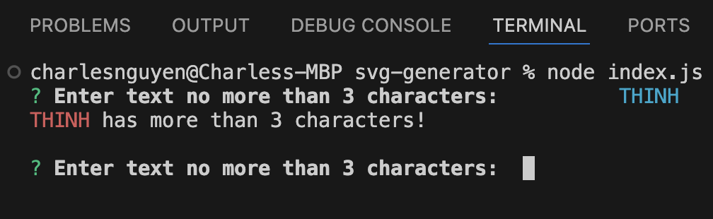

# SVG generator
SVG gnerator will help you to create a simple shape, such as square, circle, and triangle, and it automatically exports a svg file once you finish all the prompting questions.

## Achievement
1. SVG generator can help user to create a custom svg file based on user's input.
2. SVG generator can handle any exceptions effectively, such as empty input, leading and trailing space input, or invalid input.

## Exceptions
```
WHEN user enters nothing.
THEN system will display an error message on console.
```


```
WHEN user enters more than 3 characters.
THEN system will display user's input with an error message.
```


```
WHEN user add leading and/or trailing space in their input.
THEN system will trim and display error message if it has more than 3 characters. Otherwise, it will pass.
```


```
WHEN user provides an invalid color keyword or hex color value
THEN system will display user's input with an error message.
```


## Tests
To run test, you can copy the following command

```
npm run test
```


## Valid Input
```
WHEN all inputs are valid
THEN the system will display a success message on console.
```


## Demo
[](https://youtu.be/xIYeMUGIZ2Y)